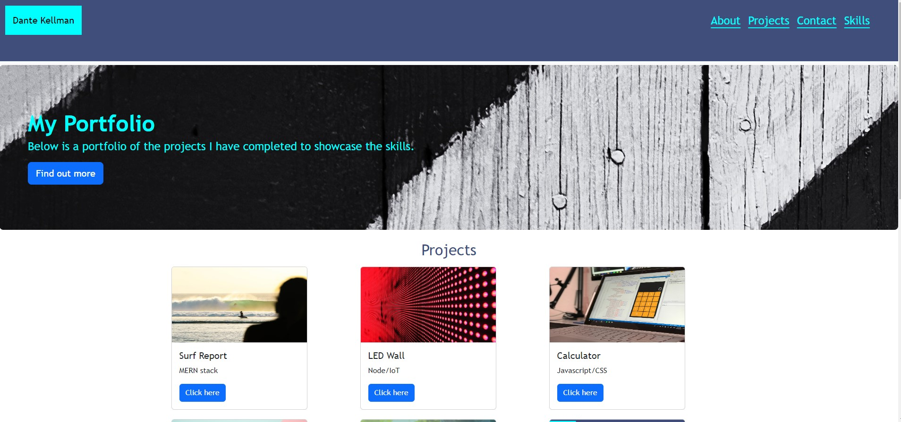

# DKT-bootstrap-portfolio

## Description

This project is a recreation of my alternative portfolio site. Here I have used Bootstrap code. I want to showcase the bootstrap skills I have learnt. This website can hold all of the web applications I build to show my capabilities if I choose to, but I already have another two portfolio websites. This project will hopefully enable me to standout to employers.

Whilst doing this project, I have learnt about HTML, CSS Grids, CSS flexbox, media queries, and CSS variables. 

## Installation

Using the live link will enable you to use this application.

## Usage

The website is easy to use. It has 4 navigation links at the top: About, Projects, Contact and Skills. All four links can be clicked and the website will scroll down to that specific section. In the Work section there are 6 projects. When clicking on the project, it will take you top that specific site. In the contact me section there are 4 options. My Resume, my social links which include Linkedin, GitHub and Twitter. Clicking on any of the three will take you to a new tab.

Below is a screenshot of my portfolio:

    ```md
    
    ```

## Credits

N/A

## License

Please refer to the license in the repo.